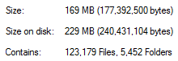
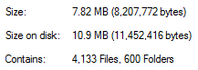

# Deduped Babel 6 Presets

[![npm package][npm-badge]][npm]

Babel 6 presets and dependencies, with their shared dependencies manually deduplicated for npm2 compatibility.

This reduces the total size for an npm2 install of this module's dependencies from ~169 MB to ~7.8 MB:

|           Before          |           After          |
|           :---:           |           :---:          |
|  |  |

The following presets are available:

## Presets

These modules provide presets for use in your Babel `presets` config:

### Core Babel Presets

Where not otherwise noted, these provide the equivalent official Babel preset:

- `deduped-babel-presets/es2015`
- `deduped-babel-presets/es2016`
- `deduped-babel-presets/react`
- `deduped-babel-presets/stage-3`
- `deduped-babel-presets/stage-2`
- `deduped-babel-presets/stage-1` - `babel-preset-stage-1` plus the [`transform-decorators-legacy`](https://github.com/loganfsmyth/babel-plugin-transform-decorators-legacy) plugin.
- `deduped-babel-presets/stage-0` - provides the same additional plugins as `babel-preset-stage-0`, but includes `deduped-babel-presets/stage-1` instead of `babel-preset-stage-1`.

### Custom Presets

- `deduped-babel-presets/es2015-loose` - `babel-preset-es2015` with [loose mode](http://www.2ality.com/2015/12/babel6-loose-mode.html) enabled where available.
- `deduped-babel-presets/es2015-native` - `babel-preset-es2015` with `es2015-modules-commonjs` disabled, for tree-shaking builds with tools like Rollup and Webpack v2.
- `deduped-babel-presets/es2015-loose-native` - a combination of the above two presets.
- `deduped-babel-presets/react-hmre` - development preset for React Hot Module Reloading and `render()` error catching.
- `deduped-babel-presets/react-prod` - production optimisations for React, using the following plugins:
  - [`react-constant-elements`](http://babeljs.io/docs/plugins/transform-react-constant-elements/)
  - [`react-remove-prop-types`](https://github.com/oliviertassinari/babel-plugin-transform-react-remove-prop-types)
- `deduped-babel-presets/runtime` - preset for using the [`transform-runtime`](http://babeljs.io/docs/plugins/transform-runtime/) plugin (with all of its features activated as per the default).
- `deduped-babel-presets/runtime-helpers` - `transform-runtime` configured solely to import helpers from `babel-runtime` when necessary.
- `deduped-babel-presets/runtime-polyfill` - `transform-runtime` configured to import helpers from `babel-runtime` and apply ES6 polyfills within your code.
- `deduped-babel-presets/runtime-regenerator` - `transform-runtime` configured to import helpers from `babel-runtime` and the `regenerator` runtime when necessary (i.e. when `async`/`await` syntax is used).

## Plugins

These modules provide plugins for use in your Babel `plugins` config:

- `deduped-babel-presets/plugins/istanbul` - the [`istanbul`](https://github.com/istanbuljs/babel-plugin-istanbul) plugin for code coverage instrumentation, which needs [`exclude`/`include` config](https://github.com/bcoe/nyc#excluding-files).
- `deduped-babel-presets/plugins/react-inline-elements` - the [`react-inline-elements`](http://babeljs.io/docs/plugins/transform-react-inline-elements/) plugin.

  This is not included in the `deduped-babel-presets/react-prod` preset because it currently depends on having `Symbol` polyfilled to work in older browsers, which has the potential to introduce breaking changes to your production build.

  See [React issue #5138](https://github.com/facebook/react/issues/5138).

## MIT Licensed

[pkgcount](https://www.npmjs.com/package/pkgcount) was used to manually deduplicate Babel 6 shared dependencies.

[npm-badge]: https://img.shields.io/npm/v/deduped-babel-presets.png?style=flat-square
[npm]: https://www.npmjs.org/package/deduped-babel-presets
